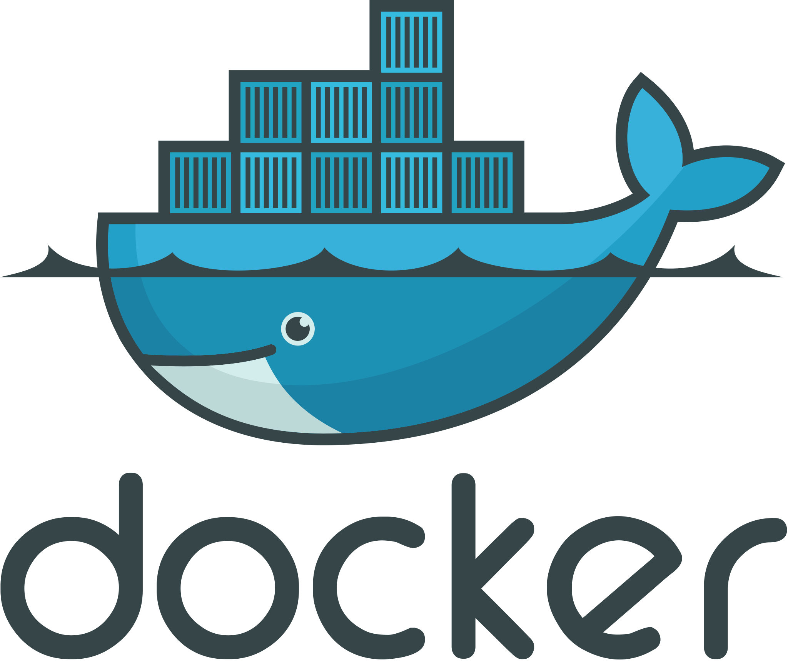
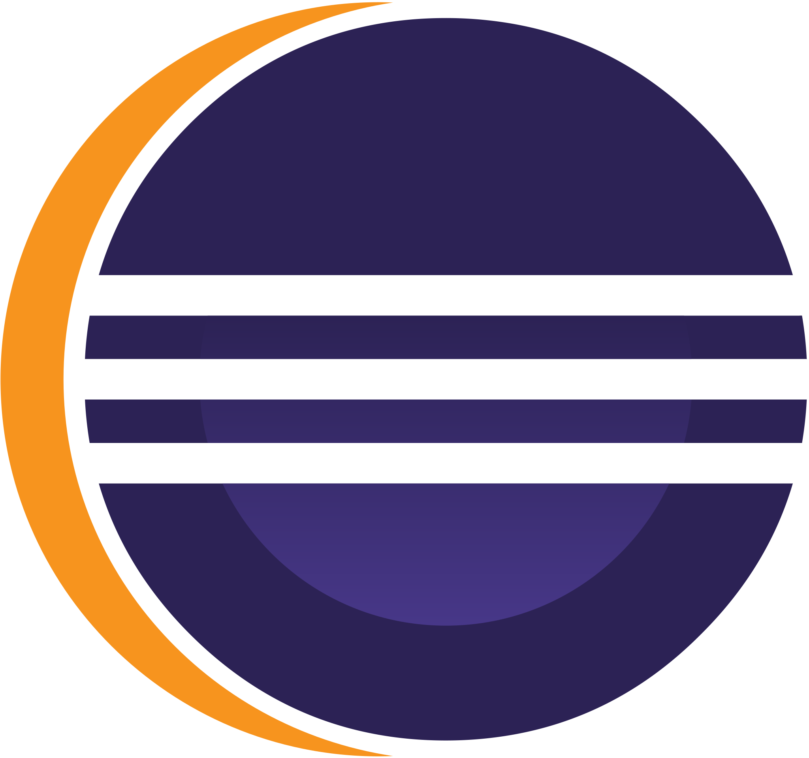

<!-- Title The Full Name -->

  

<!-- Social icons section -->

  

<!-- Information myself -->
## 👋 Hi there, Good day!   

  

    
I am currently a final year student at the Posts and Telecommunications Institute of Technology, majoring in Software Engineering. I am a person who is eager to learn, quick to grasp new concepts, hardworking, persistent, and particularly responsible in my work. I have gained extensive experience in website development, including front-end, back-end, testing, and deployment. In addition to website development, I have also participated in several IoT projects at school, which has given me a considerable amount of knowledge in embedded programming. I have many interests, including programming, listening to music, and watching movies.

## 📚 Language and Tools

  
  
  
  
  
  
  
  
  
  
  
  
  
  
  
  
  
  
  
  
  
  
  
  
  
  
  
  
  

##  Leetcode
<!-- Leetcode -->

